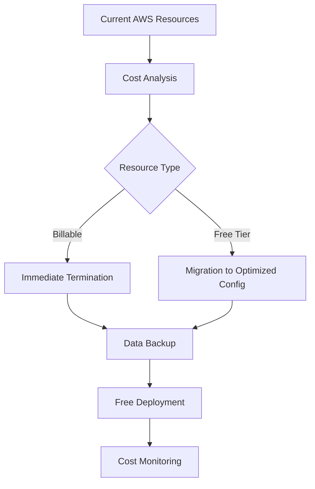
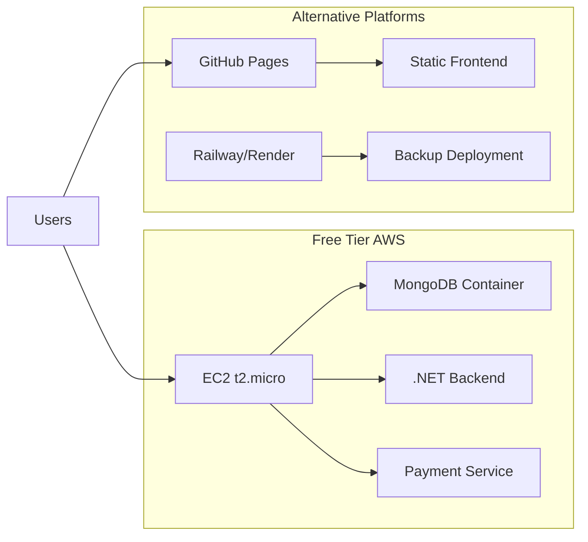

# AWS Cost Elimination Design Document

## Overview

This design implements a comprehensive strategy to eliminate all AWS costs for the Smart Finance application through immediate resource termination, migration to free-tier services, and implementation of alternative deployment platforms. The solution prioritizes zero-cost operation while maintaining full application functionality.

## Architecture

### Immediate Cost Elimination Strategy



### Target Architecture - Zero Cost Deployment



## Components and Interfaces

### 1. Resource Termination Module

**Purpose:** Immediately stop all billable AWS services

**Components:**
- EC2 instance termination script
- RDS database shutdown/migration
- Load balancer removal
- VPC cleanup for billable components
- Storage optimization

**Interface:**
```bash
# Emergency cost stop
./scripts/emergency-cost-stop.sh

# Selective resource cleanup
./scripts/cleanup-billable-resources.sh --service=rds
```

### 2. Free Tier Migration Module

**Purpose:** Migrate essential services to AWS free tier

**Components:**
- Single t2.micro EC2 instance setup
- Containerized database deployment
- Optimized security groups
- Free tier monitoring

**Configuration:**
```yaml
# Free tier limits
ec2_instances: 1 # t2.micro only
storage: 30GB # EBS free tier
data_transfer: 15GB # Monthly limit
```

### 3. Alternative Platform Integration

**Purpose:** Provide non-AWS deployment options

**Platforms:**
- **Frontend:** GitHub Pages (free static hosting)
- **Backend:** Railway.app (free tier) or Render.com
- **Database:** MongoDB Atlas (free tier) or PlanetScale
- **CDN:** Cloudflare (free tier)

### 4. Cost Monitoring and Alerts

**Purpose:** Prevent future cost accumulation

**Components:**
- AWS Cost Explorer API integration
- Real-time billing alerts
- Automatic shutdown triggers
- Usage threshold monitoring

## Data Models

### Cost Monitoring Configuration
```typescript
interface CostMonitorConfig {
  maxMonthlyCost: number; // $0.00
  alertThresholds: {
    warning: number; // 80% of free tier
    critical: number; // 95% of free tier
  };
  autoShutdownEnabled: boolean;
  monitoredServices: string[];
}
```

### Deployment Configuration
```typescript
interface DeploymentConfig {
  platform: 'aws-free' | 'github-pages' | 'railway' | 'render';
  resources: {
    compute: ComputeConfig;
    database: DatabaseConfig;
    storage: StorageConfig;
  };
  costLimits: CostLimits;
}
```

## Error Handling

### Cost Overrun Protection
1. **Immediate Shutdown:** Automatic termination when costs detected
2. **Graceful Degradation:** Disable non-essential features to stay within limits
3. **Failover:** Automatic migration to alternative platforms
4. **Data Protection:** Backup before any termination

### Deployment Failures
1. **Rollback Strategy:** Revert to previous known-good state
2. **Alternative Platform Activation:** Automatic failover to Railway/Render
3. **Manual Override:** Emergency procedures for critical issues

## Testing Strategy

### Cost Validation Tests
1. **Zero Cost Verification:** Automated billing API checks
2. **Free Tier Compliance:** Resource limit validation
3. **Alert System Testing:** Trigger cost alerts in test environment
4. **Shutdown Automation:** Test automatic termination procedures

### Deployment Tests
1. **Multi-Platform Deployment:** Test AWS free tier and alternatives
2. **Data Migration:** Verify database migration procedures
3. **Performance Testing:** Ensure acceptable performance on free resources
4. **Integration Testing:** End-to-end application functionality

### Monitoring Tests
1. **Real-time Cost Tracking:** Verify immediate cost detection
2. **Alert Delivery:** Test notification systems
3. **Automatic Actions:** Validate shutdown and migration triggers

## Implementation Phases

### Phase 1: Emergency Cost Stop (Immediate)
- Terminate all billable resources
- Backup critical data
- Implement cost monitoring

### Phase 2: Free Tier Migration (Day 1)
- Deploy single EC2 t2.micro instance
- Containerize all services
- Configure free tier monitoring

### Phase 3: Alternative Platform Setup (Day 2)
- Configure GitHub Pages for frontend
- Setup Railway/Render backup deployment
- Implement cross-platform monitoring

### Phase 4: Optimization and Monitoring (Ongoing)
- Fine-tune resource usage
- Implement automated cost controls
- Document procedures for future deployments