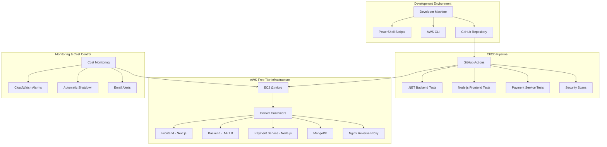
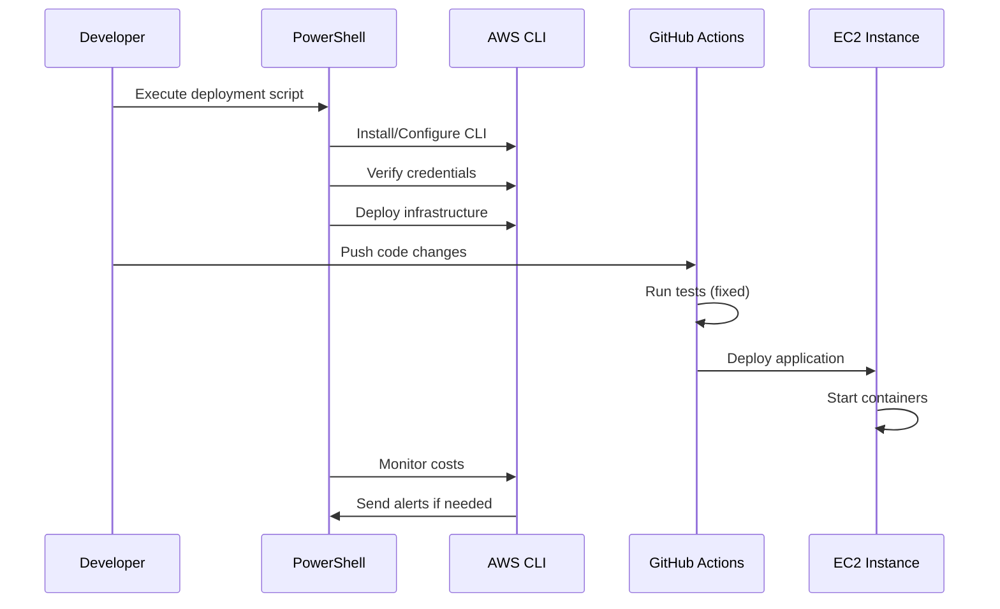

# Design Document

## Overview

This design addresses the complete resolution of SmartFinance deployment issues, including PowerShell script fixes, AWS CLI installation, GitHub CI/CD pipeline repairs, and zero-cost EC2 deployment. The solution ensures 100% functionality while maintaining strict zero-cost constraints.

## Architecture

### System Components



### Deployment Flow



## Components and Interfaces

### 1. AWS CLI Installation and Configuration

**Component**: AWS CLI Setup Module
- **Purpose**: Automated installation and configuration of AWS CLI on Windows
- **Interface**: PowerShell cmdlets and AWS CLI commands
- **Dependencies**: Windows PowerShell, Internet connectivity

**Key Functions**:
- Download and install AWS CLI v2 for Windows
- Configure credentials using environment variables or AWS profiles
- Set default region and output format
- Validate installation and connectivity

### 2. PowerShell Script Error Resolution

**Component**: Script Error Handler
- **Purpose**: Fix PowerShell syntax errors and variable scoping issues
- **Interface**: PowerShell script execution environment
- **Dependencies**: PowerShell 5.1+ or PowerShell Core

**Key Fixes**:
- Replace `$using:` variables with proper parameter passing
- Fix variable scoping in script blocks
- Implement proper error handling with try-catch blocks
- Add parameter validation and type checking

### 3. GitHub CI/CD Pipeline Fixes

**Component**: CI/CD Pipeline Orchestrator
- **Purpose**: Resolve failing tests and build processes
- **Interface**: GitHub Actions workflows, Docker, npm, dotnet CLI
- **Dependencies**: GitHub Actions runners, test frameworks

**Test Fixes Required**:

#### .NET Backend Tests
- Missing test project references
- Incorrect test configuration
- Database connection issues in tests
- Missing test data setup

#### Payment Microservice Tests
- Missing Jest configuration
- TypeScript compilation errors
- Missing test files
- Incorrect test scripts

#### Security Scan Issues
- Trivy scanner configuration
- SARIF output format issues
- Permission problems with security uploads

### 4. Zero-Cost EC2 Infrastructure

**Component**: Free Tier Infrastructure Manager
- **Purpose**: Deploy and manage AWS resources within free tier limits
- **Interface**: CloudFormation, Docker Compose, EC2 APIs
- **Dependencies**: AWS Free Tier account, t2.micro instances

**Resource Specifications**:
- EC2 Instance: t2.micro (1 vCPU, 1GB RAM)
- Storage: 30GB EBS GP2 (free tier limit)
- Network: Default VPC with public subnet
- Security Groups: HTTP/HTTPS/SSH access
- No Load Balancers, NAT Gateways, or RDS instances

### 5. Application Container Architecture

**Component**: Containerized Application Stack
- **Purpose**: Run all services in Docker containers on single EC2 instance
- **Interface**: Docker Compose, container networking
- **Dependencies**: Docker Engine, sufficient memory allocation

**Container Layout**:
```yaml
services:
  nginx:          # Reverse proxy (80MB RAM)
  frontend:       # Next.js app (150MB RAM)
  backend:        # .NET API (200MB RAM)
  payment:        # Node.js service (100MB RAM)
  mongodb:        # Database (300MB RAM)
  # Total: ~830MB (within 1GB t2.micro limit)
```

### 6. Cost Monitoring and Alerting

**Component**: Cost Control System
- **Purpose**: Monitor AWS costs and prevent billing charges
- **Interface**: AWS Cost Explorer API, CloudWatch, SNS
- **Dependencies**: AWS CLI, PowerShell, email service

**Monitoring Features**:
- Real-time cost tracking
- Free tier usage monitoring
- Automatic resource shutdown
- Email alerts for any cost detection
- Daily usage reports

## Data Models

### 1. AWS Resource Configuration

```typescript
interface AWSResourceConfig {
  instanceType: 't2.micro';
  region: string;
  availabilityZone: string;
  keyPairName: string;
  securityGroupId: string;
  subnetId: string;
  imageId: string; // Amazon Linux 2 AMI
}
```

### 2. Cost Monitoring Data

```typescript
interface CostData {
  currentCost: number;
  forecastedCost: number;
  freeTierUsage: {
    ec2Hours: number;
    ebsStorage: number;
    dataTransfer: number;
  };
  alerts: CostAlert[];
}

interface CostAlert {
  type: 'warning' | 'critical';
  message: string;
  timestamp: Date;
  action: 'notify' | 'shutdown';
}
```

### 3. Deployment Status

```typescript
interface DeploymentStatus {
  phase: 'preparation' | 'infrastructure' | 'application' | 'verification';
  status: 'running' | 'completed' | 'failed';
  services: ServiceStatus[];
  healthChecks: HealthCheck[];
}

interface ServiceStatus {
  name: string;
  status: 'starting' | 'running' | 'stopped' | 'error';
  port: number;
  healthEndpoint: string;
}
```

## Error Handling

### 1. PowerShell Script Errors

**Strategy**: Comprehensive error handling with graceful degradation
- Use `try-catch-finally` blocks for all AWS operations
- Implement retry logic for transient failures
- Provide clear error messages with resolution steps
- Log all operations for debugging

**Example Error Handling**:
```powershell
try {
    $result = aws ec2 describe-instances --region $Region
    if ($LASTEXITCODE -ne 0) {
        throw "AWS CLI command failed with exit code $LASTEXITCODE"
    }
}
catch {
    Write-Error "Failed to describe EC2 instances: $($_.Exception.Message)"
    Write-Host "Possible solutions:" -ForegroundColor Yellow
    Write-Host "1. Check AWS CLI installation: aws --version"
    Write-Host "2. Verify credentials: aws sts get-caller-identity"
    Write-Host "3. Check region setting: aws configure get region"
    exit 1
}
```

### 2. CI/CD Pipeline Failures

**Strategy**: Fail-fast with detailed diagnostics
- Separate test failures from build failures
- Provide artifact uploads for failed tests
- Implement test result caching
- Add retry mechanisms for flaky tests

### 3. Deployment Failures

**Strategy**: Rollback and recovery mechanisms
- Maintain previous deployment backup
- Implement health checks with timeouts
- Automatic rollback on failure
- Service-level restart capabilities

### 4. Cost Overrun Protection

**Strategy**: Multi-layered protection system
- Real-time cost monitoring
- Predictive cost analysis
- Automatic resource termination
- Manual override capabilities for emergencies

## Testing Strategy

### 1. Unit Testing

**Backend (.NET)**:
- Use xUnit framework
- Mock external dependencies
- Test business logic in isolation
- Achieve >80% code coverage

**Payment Service (Node.js)**:
- Use Jest framework
- Mock Redis and MongoDB connections
- Test API endpoints with supertest
- Validate payment processing logic

**Frontend (Next.js)**:
- Use Jest + React Testing Library
- Test component rendering
- Mock API calls
- Test user interactions

### 2. Integration Testing

**API Integration**:
- Test end-to-end API workflows
- Validate database operations
- Test authentication and authorization
- Verify payment processing integration

**Container Integration**:
- Test Docker Compose setup
- Validate service communication
- Test health check endpoints
- Verify environment variable handling

### 3. Infrastructure Testing

**AWS Resource Validation**:
- Verify EC2 instance configuration
- Test security group rules
- Validate networking setup
- Confirm free tier compliance

**Cost Monitoring Testing**:
- Test cost alert thresholds
- Validate automatic shutdown triggers
- Test email notification delivery
- Verify cost calculation accuracy

### 4. End-to-End Testing

**Deployment Pipeline**:
- Test complete deployment process
- Validate rollback mechanisms
- Test monitoring and alerting
- Verify application functionality post-deployment

**User Acceptance Testing**:
- Test all application features
- Validate user workflows
- Test performance under load
- Verify security measures

## Security Considerations

### 1. AWS Security

- Use IAM roles with minimal permissions
- Enable CloudTrail for audit logging
- Configure security groups with least privilege
- Use encrypted EBS volumes
- Implement VPC security best practices

### 2. Application Security

- Use HTTPS for all communications
- Implement JWT token authentication
- Validate all input parameters
- Use secure password hashing
- Enable CORS with specific origins

### 3. Container Security

- Use official base images
- Scan images for vulnerabilities
- Run containers as non-root users
- Limit container resource usage
- Use Docker secrets for sensitive data

### 4. CI/CD Security

- Use GitHub secrets for sensitive data
- Implement branch protection rules
- Require code review for deployments
- Use signed commits where possible
- Scan dependencies for vulnerabilities

## Performance Optimization

### 1. Resource Optimization

**Memory Management**:
- Optimize container memory allocation
- Use memory-efficient base images
- Implement garbage collection tuning
- Monitor memory usage patterns

**CPU Optimization**:
- Use multi-stage Docker builds
- Optimize application startup time
- Implement efficient caching strategies
- Use connection pooling

### 2. Network Optimization

- Use nginx for static file serving
- Implement gzip compression
- Optimize API response sizes
- Use CDN for static assets (if within free tier)

### 3. Database Optimization

- Use MongoDB indexes effectively
- Implement connection pooling
- Optimize query patterns
- Use appropriate data types

## Monitoring and Observability

### 1. Application Monitoring

- Health check endpoints for all services
- Application performance metrics
- Error rate monitoring
- Response time tracking

### 2. Infrastructure Monitoring

- EC2 instance metrics (CPU, memory, disk)
- Docker container resource usage
- Network traffic monitoring
- Disk space utilization

### 3. Cost Monitoring

- Real-time AWS cost tracking
- Free tier usage monitoring
- Predictive cost analysis
- Alert threshold management

### 4. Logging Strategy

- Centralized logging with structured format
- Log rotation and retention policies
- Error tracking and alerting
- Performance log analysis